# OflineLibraryManagementSystemProject
<b>ADMIN LOGIN</b>

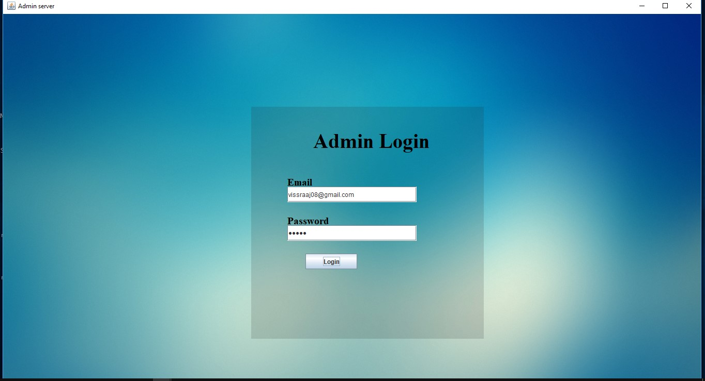

<b>Details</b>

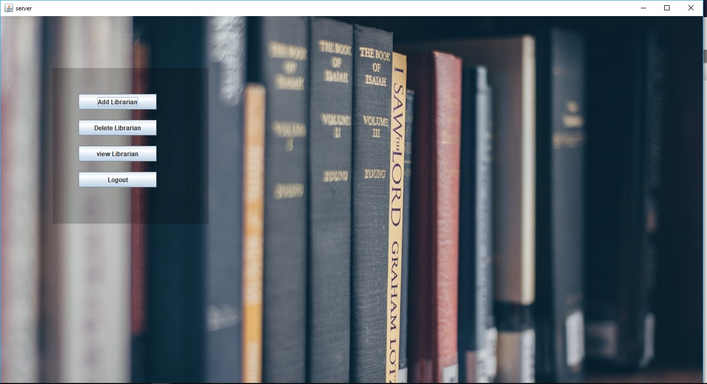

<b>Add Librarian</b>

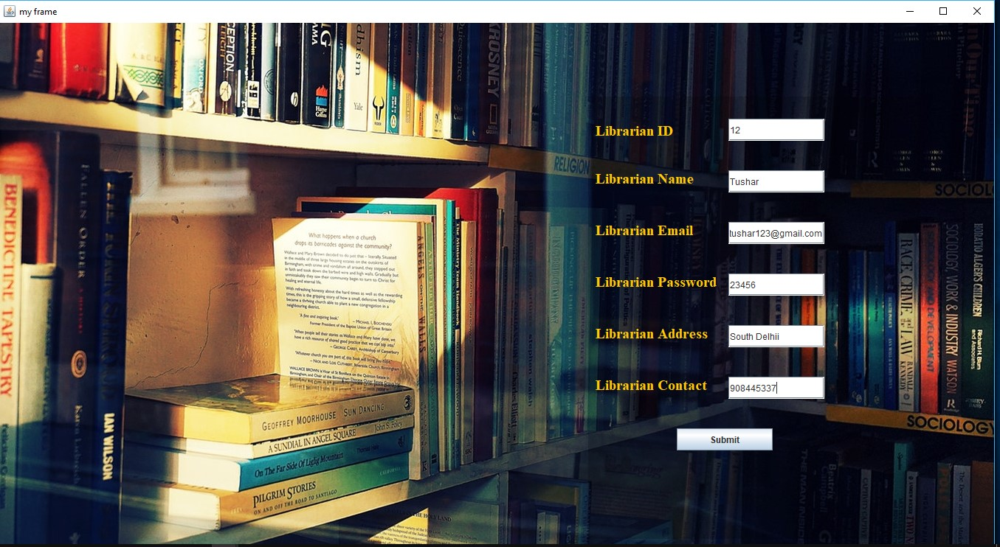

<b>Delete Librarian</b>

<b>Details Of Librarian</b>

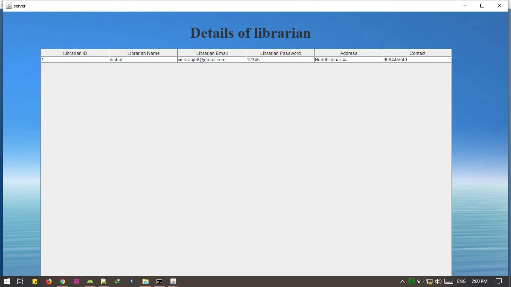

<b>Librarian Login</b>

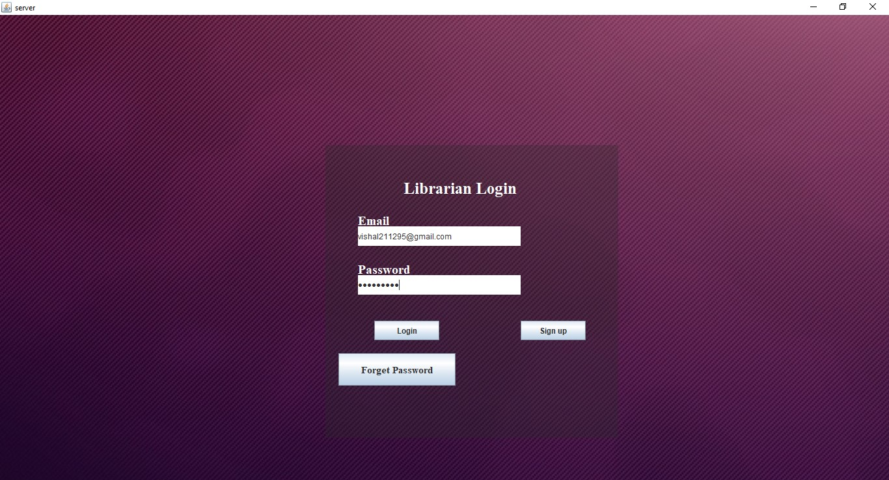

<b>Book Information</b>

<b>Add Book</b>

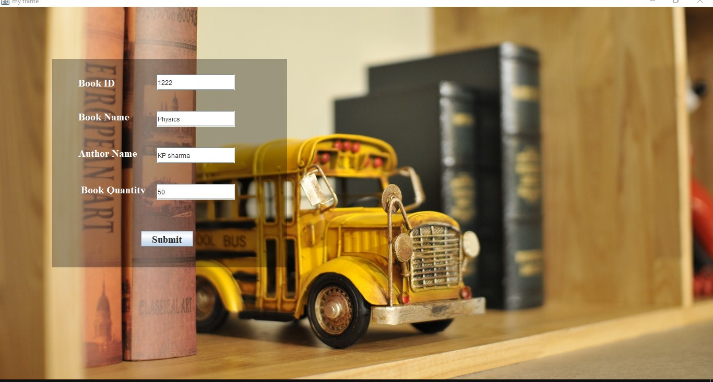

<b>Delete Book</b>

<b>Update Book</b>

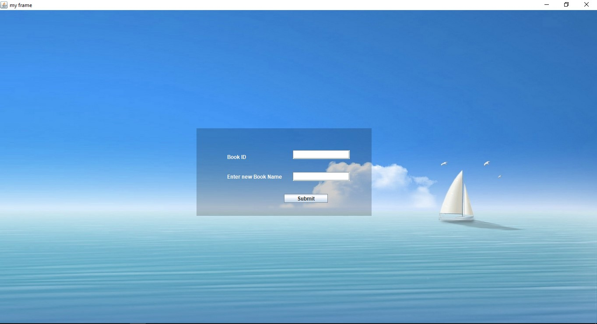

<b>Search Book</b>

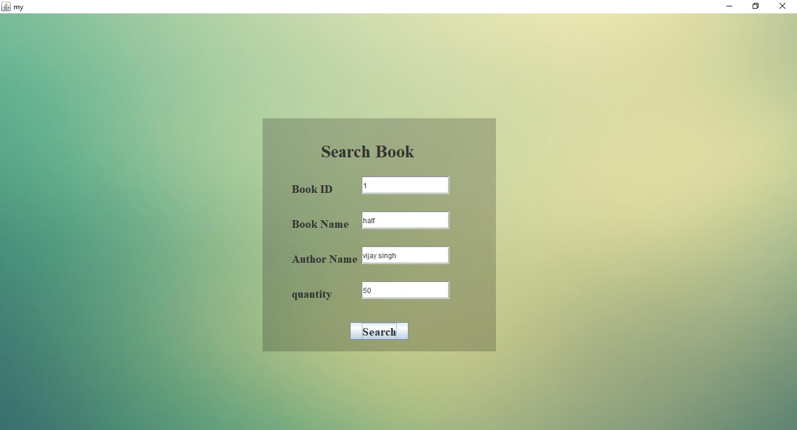

<b>Issue Book</b>

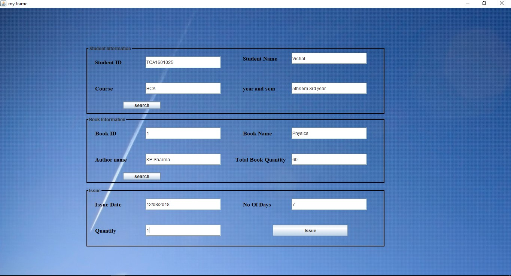

<b>Return Book</b>

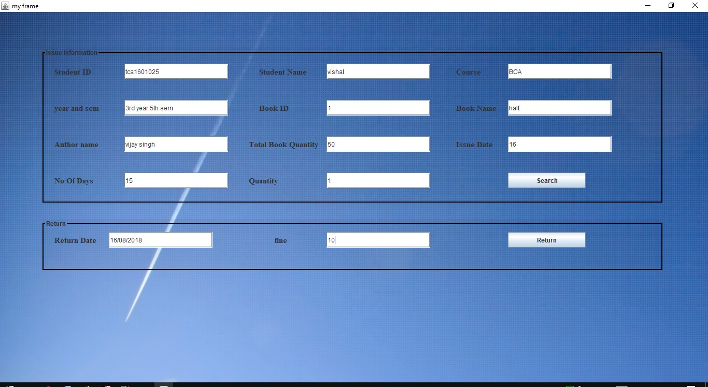

<b>View Issue Book</b>

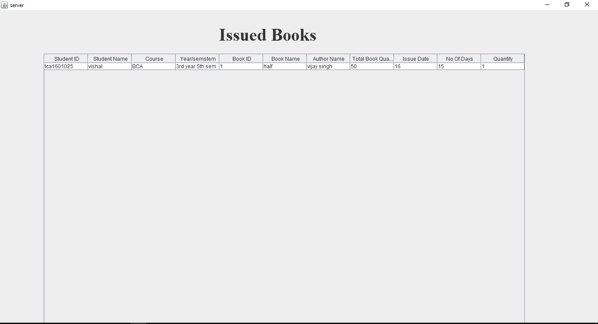

<b>View Return Book</b>

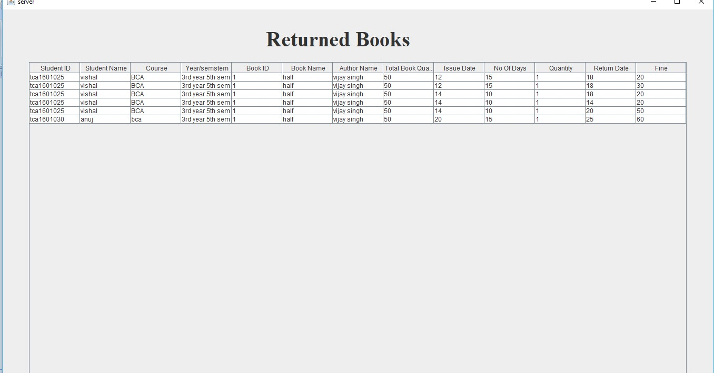
